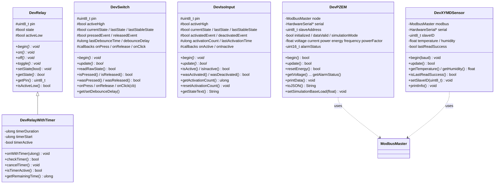

# Blueprint: HW Class for Device (ESP32 / Arduino)

เอกสารสรุปโครงสร้างคลาสทั้งหมดใน [include/](include/) (header-only, ไม่มีไฟล์ .cpp)

## 1. ภาพรวม

| ไฟล์ | คลาส | หน้าที่ | ชนิด | Dependency |
|------|------|---------|------|------------|
| [DevRelay.h](include/DevRelay.h) | `DevRelay`, `DevRelayWithTimer` | ควบคุม Relay (Active Low/High) + Timer ปิดอัตโนมัติ | Output / GPIO | Arduino.h |
| [DevSwitch.h](include/DevSwitch.h) | `DevSwitch` | ปุ่มกด + debounce + edge event + callback | Input / GPIO | Arduino.h |
| [DevIsoInput.h](include/DevIsoInput.h) | `DevIsoInput` | Isolated digital input + debounce + นับจำนวนครั้งที่ active | Input / GPIO | Arduino.h |
| [DevPZEM.h](include/DevPZEM.h) | `DevPZEM` | อ่านมิเตอร์ไฟ AC PZEM-016 ผ่าน Modbus RTU (มี simulation fallback) | Sensor / RS485 | ModbusMaster |
| [DevXYMDSensor.h](include/DevXYMDSensor.h) | `DevXYMDSensor` | อ่านอุณหภูมิ/ความชื้น XY-MD03 ผ่าน Modbus RTU | Sensor / RS485 | ModbusMaster |

### Conventions ร่วมกัน
- ชื่อคลาสขึ้นต้น `Dev`; header guard แบบ `DEV_XXX_H`; เขียนทุกอย่างใน header (inline ใน class)
- วงจรชีวิตมาตรฐาน: **constructor → `begin()` → เรียก `update()` ซ้ำใน `loop()` → ใช้ getter**
- Input class (Switch, IsoInput) ใช้ non-blocking `millis()` ไม่ใช้ `delay()` (ต่างจาก PZEM ที่ใช้ `delay` ใน `update()`)
- Callback เป็น plain function pointer `void (*)()` (ไม่รองรับ lambda ที่ capture)

### Pin assignment: Switch บนบอร์ด

| Switch | GPIO | Logic | Pull-up |
|--------|------|-------|---------|
| SW1 | 34 | Active Low | 10 kΩ ภายนอก (บนบอร์ด) |
| SW2 | 35 | Active Low | 10 kΩ ภายนอก (บนบอร์ด) |
| SW3 | 32 | Active Low | 10 kΩ ภายนอก (บนบอร์ด) |

- สร้างด้วย `DevSwitch(pin)` ได้เลย (default `activeHigh = false` = Active Low)
- GPIO34/35 เป็น *input-only* และ **ไม่มี internal pull-up** → `INPUT_PULLUP` ที่ `DevSwitch::begin()` ตั้งให้ไม่มีผลกับสองขานี้ แต่ใช้งานได้เพราะมี pull-up ภายนอก 10 kΩ บนบอร์ดแล้ว
- [main.cpp](src/main.cpp) ใช้ SW1/SW2/SW3 สลับ Relay1/2/3 ตามลำดับ และย้าย `DevIsoInput` ไปที่ GPIO33 (ISOIN1) เพื่อไม่ให้ชน GPIO34

### Pin assignment: Relay บนบอร์ด

**ชนิด: Active LOW** (สั่ง `LOW` = Relay ON, สั่ง `HIGH` = Relay OFF) ตรงกับ default ของ `DevRelay(pin)` (`activeLow = true`)

| Relay | GPIO |
|-------|------|
| relay1 | 17 |
| relay2 | 16 |
| relay3 | 4 |

- ⚠️ GPIO16/17 เป็นขา RX/TX default ของ `Serial2` (UART2) ซึ่งตรงกับ relay2/relay1 — ถ้า `DevXYMDSensor` ใช้ `Serial2` ด้วยค่า default จะชนกับ relay ต้องกำหนดขา UART2 เองด้วย `Serial2.begin(baud, SERIAL_8N1, rx, tx)` ที่ไม่ใช่ 16/17

### Pin assignment: OLED SSD1306 (I2C)

| ขา OLED | ต่อกับ |
|---------|--------|
| VCC | 3V3 |
| GND | GND |
| SDA | GPIO21 |
| SCL | GPIO22 |

- I2C address มักเป็น `0x3C` (ถ้าจอไม่ขึ้นลอง `0x3D`)

## 2. แผนภาพคลาส



`*` = `virtual`. มี inheritance เพียงคู่เดียวคือ `DevRelay → DevRelayWithTimer`; คลาสอื่นอิสระต่อกัน

## 3. รายละเอียดแต่ละคลาส

### 3.1 DevRelay / DevRelayWithTimer
- **Constructor:** `DevRelay(uint8_t gpioPin, bool activeLow = true)`
- **Logic ขา:** `on()` → `digitalWrite(activeLow ? LOW : HIGH)`, `off()` กลับกัน; ตัวแปร `state` เก็บสถานะ logic (true = ON) ไม่ใช่ระดับไฟที่ขา
- **`begin()`** ตั้ง `OUTPUT` แล้วเรียก `off()` ทันที (ปลอดภัยตอนบูต)
- **`DevRelayWithTimer`** เพิ่ม:
  - `onWithTimer(ms)` → เปิดแล้วจับเวลา
  - `checkTimer()` ต้องเรียกใน `loop()`; คืน `true` ครั้งเดียวตอนหมดเวลาและปิด relay
  - `cancelTimer()` ยกเลิก timer โดยไม่ปิด relay
  - `getRemainingTime()` เวลาที่เหลือ (ms)
- เรียก `off()`/`toggle()` ด้วยมือไม่ได้ยกเลิก `timerActive` (แต่ `checkTimer` เช็ค `state` ด้วย จึงไม่ปิดซ้ำ)

### 3.2 DevSwitch
- **Constructor:** `DevSwitch(pin, activeHigh = false, debounceMs = 50)`
- **Pin mode:** Active Low → `INPUT_PULLUP`; Active High → `INPUT` (ต้องมี pulldown ภายนอก)
- **Debounce (ใน `update()`):**
  1. อ่าน raw (`readRawState()` กลับค่าให้อัตโนมัติถ้า Active Low)
  2. raw ≠ `lastState` → รีเซ็ต `lastDebounceTime`
  3. ถ้านิ่งเกิน `debounceDelay` และ ≠ `lastStableState` → ยอมรับเป็นสถานะใหม่
  4. ตั้ง `pressedEvent` / `releasedEvent` (true เฉพาะรอบนั้น) และเรียก callback
- **Callback:** `onPress` (ตอนกด), `onRelease` และ `onClick` (ตอนปล่อย; click = press+release)
- `update()` คืน `true` เมื่อสถานะเสถียรเปลี่ยน

### 3.3 DevIsoInput
โครงสร้างเหมือน `DevSwitch` เกือบทุกประการ ต่างกันที่ความหมายและส่วนเสริม:
- ศัพท์: `active/inactive` แทน `pressed/released`; event: `wasActivated()` / `wasDeactivated()`
- Callback: `onActive`, `onInactive` (ไม่มี click)
- เพิ่ม **`activationCount`**, **`lastActivationTime`**, `resetActivationCount()`, `getStateText()` ("ACTIVE"/"INACTIVE")
- เหมาะกับ input แยกกราวด์ (optocoupler) เช่น สัญญาณ dry contact / ไฟ AC detect

### 3.4 DevPZEM (PZEM-016 AC Power Monitor)
- **Constructor:** `DevPZEM(HardwareSerial* serial = &Serial, uint8_t addr = 0x01)`
- **Hardware:** Modbus RTU 9600 8N1, ผ่าน MAX13487 (RS232↔RS485 auto direction) บน Serial/UART0 เดียวกับที่ใช้โปรแกรม
- **`begin()`:** ล้าง buffer → `node.begin` → ลองอ่านแรงดัน reg 0x0000 สูงสุด 3 ครั้ง; ถ้าไม่ตอบ → **fallback เป็น Simulation Mode อัตโนมัติ** (และคืน `true` เสมอ)
- **`update()`:** throttle ด้วย `readInterval = 2000 ms` (ยังไม่ถึงเวลา → คืน `dataValid` เดิม) แล้วอ่านทีละ register มี `delay(100)` คั่น

  | ค่า | Register | ขนาด | Scale |
  |-----|----------|------|-------|
  | Voltage | 0x0000 | 16-bit | ×0.1 V |
  | Current | 0x0001 | 32-bit (low word ก่อน) | ×0.001 A |
  | Power | 0x0003 | 32-bit | ×0.1 W |
  | Energy | 0x0005 | 32-bit | Wh (getter แปลงเป็น kWh) |
  | Frequency | 0x0007 | 16-bit | ×0.1 Hz |
  | Power Factor | 0x0008 | 16-bit | ×0.01 |
  | Alarm | 0x0009 | 16-bit | raw |

  Reset energy: เขียน reg 0x0042 (`resetEnergy()`)
- **Validation:** ผิดถ้าอ่านแรงดันไม่ได้หรือ V ไม่อยู่ใน 0–300 → `dataValid = false`; getter ทุกตัวคืน 0 เมื่อ `dataValid == false`
- **Simulation:** `generateSimulatedData()` สร้าง V≈220±3, I จาก `baseLoad`, PF 0.85–0.95, f≈50±0.3 และสะสม energy; ปรับด้วย `setSimulationBaseLoad(W)`; ตรวจด้วย `isSimulationMode()`
- **Output:** `printData()` (Serial), `toJSON()` (slaveId, simulation, ค่าทั้งหมด, valid)
- **Free functions:** `preTransmission()` / `postTransmission()` ถูกประกาศใน header (ดูหัวข้อ 5)

### 3.5 DevXYMDSensor (XY-MD03 Temp/Humidity)
- **Constructor:** `DevXYMDSensor(HardwareSerial* hwSerial, uint8_t slaveId = 1)` (ต้องส่ง serial เอง ไม่มี default)
- **`begin(baud = 9600)`:** `serial->begin(baud, SERIAL_8N1)` + `modbus.begin(slaveID, *serial)`; ไม่ใช้ DE/RE (auto direction)
- **`update()`:** อ่าน input register 2 ตัวตั้งแต่ 0x0001 (FC04) → temp = raw/10, humidity = raw/10; ล้มเหลวจะไม่แก้ค่าเดิม แต่ตั้ง `lastReadSuccess = false`
- **อื่นๆ:** `getTemperature()`, `getHumidity()`, `isLastReadSuccess()`, `getLastReadTime()`, `setSlaveID()` (re-init modbus), `printInfo()`
- ไม่มี throttle ใน class ผู้ใช้ต้องคุมความถี่การเรียก `update()` เอง

## 4. Usage Pattern

```cpp
DevRelayWithTimer relay(26);
DevSwitch button(0);
DevIsoInput input(34);
DevPZEM pzem(&Serial);

void setup() {
  relay.begin(); button.begin(); input.begin(); pzem.begin();
  button.onClick([]() { /* non-capturing only */ });
}

void loop() {
  button.update();
  input.update();
  relay.checkTimer();
  if (pzem.update()) { /* pzem.getPower() ... */ }
}
```

## 5. ข้อสังเกต / ความเสี่ยงที่พบ

1. **[DevPZEM.h:26-36](include/DevPZEM.h#L26-L36)** — `preTransmission()`/`postTransmission()` เป็นฟังก์ชันธรรมดา (ไม่ `inline`/`static`) ใน header; ถ้า include จากหลาย .cpp จะเกิด *multiple definition* ตอน link (ตอนนี้ใช้ได้เพราะ include แค่ใน main.cpp)
2. **Serial ชนกัน** — `DevPZEM` ใช้ `Serial` (UART0) ซึ่งเป็นพอร์ตเดียวกับ log (`Serial.printf`) และ `DevXYMDSensor` (ถ้าส่ง `&Serial`) ทำให้ debug print ปนกับ Modbus frame; ถ้าใช้สองเซนเซอร์ต้องแยก UART (`Serial1`/`Serial2`) หรือใช้ bus เดียวกันคนละ slave ID โดยระวัง baud/สลับ `modbus.begin`
3. **`DevPZEM::update()` blocking** — ใช้ `delay(100)` 6 ครั้ง (~0.6 s ต่อรอบ) ทุก 2 s จะทำให้ `loop()` ที่ poll ปุ่ม/input พลาด event ถ้าอยู่ใน loop เดียวกัน
4. **`DevPZEM::begin()` คืน `true` เสมอ** — ผู้เรียกแยกโหมดจริง/จำลองได้เฉพาะผ่าน `isSimulationMode()`
5. **`DevPZEM::toJSON()`** ใช้ `voltage`/`current` ดิบ แต่ `energy` ผ่าน getter (ซึ่งคืน 0 เมื่อ invalid) จึงไม่สอดคล้องกัน
6. **`DevSwitch` กับ `DevIsoInput` ซ้ำโค้ด** ~90% — ถ้าจะ refactor ควรดึง base class `DevDebouncedInput` ร่วมกัน (ตอนนี้ใช้ `protected` + `virtual` เผื่อ inherit อยู่แล้ว)
7. **Debounce ครั้งแรก** — `lastDebounceTime = 0` ตอน construct; ถ้า input เปลี่ยนก่อนครบ debounce ตั้งแต่บูตอาจมี event แรกช้าเล็กน้อย (ไม่กระทบการใช้งานจริง)
8. **Callback เป็น function pointer** — ใช้ lambda แบบ capture หรือ `std::function` ไม่ได้ ถ้าต้องการ context ให้ใช้ global/static หรือเปลี่ยนเป็น `std::function<void()>`
9. **ไม่มี virtual destructor** ใน `DevRelay`/`DevSwitch`/`DevIsoInput` — ปลอดภัยตราบใดที่ไม่ `delete` ผ่าน base pointer

## 6. แนวทางเพิ่มคลาสใหม่ (Template)

1. ตั้งชื่อ `DevXxx` ไฟล์ `include/DevXxx.h` พร้อม guard `DEV_XXX_H`
2. มีเมธอด `begin()` และ (ถ้าเป็น input/sensor) `update()` ที่คืน `bool` ว่าสำเร็จ/เปลี่ยนแปลง
3. ใช้ `millis()` แบบ non-blocking; หลีกเลี่ยง `delay()`
4. Getter เป็น `const`; ให้ `toJSON()`/`printInfo()` เมื่อเป็น sensor
5. ถ้าต้องใช้ฟังก์ชัน global ใน header ให้ใส่ `inline`
